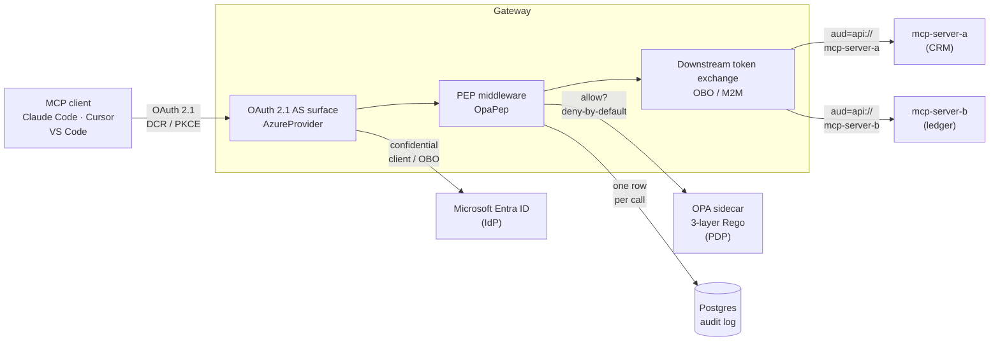
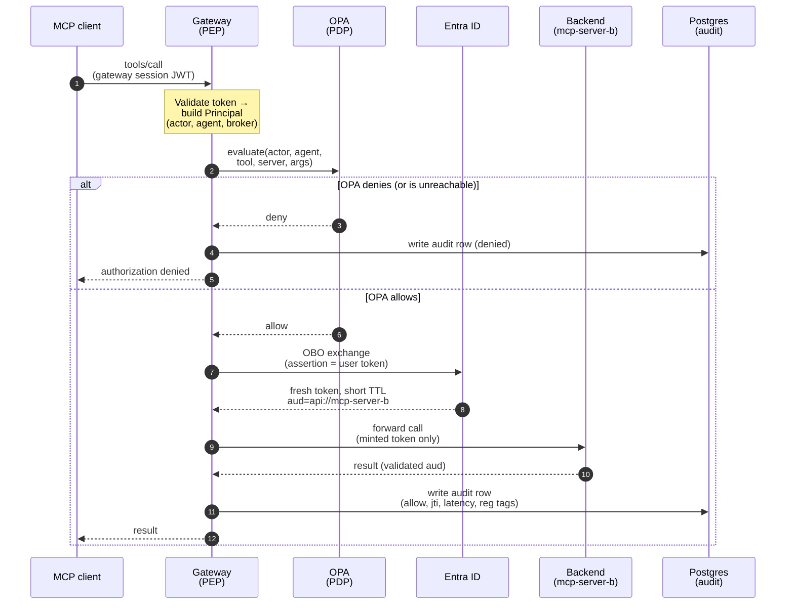

*Part 1 of three. A walk-through of an open, MIT-licensed reference gateway I built on FastMCP, OPA and Microsoft Entra ID.*



---

## What this series is for

The gateway this series describes is a **teaching artifact**. It runs, it is tested, and every claim below is something you can go and read in [the repo](https://github.com/Jayjo86/mcp-gateway-reference) — but it exists to show you what an MCP gateway has to do, not to be dropped into your cluster on Monday.

So read it the way you would read a worked example. The interesting parts are the shape of the control point, the ordering of the steps inside it, and the handful of places where the obvious implementation is quietly wrong. Copy those. Copy the code too if it helps, but the code is the cheap half.

That framing also answers the question you are probably already asking, which is whether you should buy this instead of building it. Quite possibly you should. Several vendors sell an MCP gateway, and API management products are growing MCP support fast. What none of them can do for you is decide which of your users may call which tool with which arguments, classify your tools against your regulator, or own the audit schema your compliance team will be reading in two years. Treat the three parts of this series as the checklist you evaluate a product against — and as the description of what you will still own after you have bought one.

---

## The problem

The Model Context Protocol lets AI agents — Claude Code, Cursor, VS Code, and a growing fleet of others — call tools that touch real systems: your CRM, your ledger, your data platform. That is what makes it useful. It is also what makes it dangerous to deploy naively.

Point an agent at your backends with no control point in the middle and every backend has to independently answer four questions:

1. Who is the human behind this agent?
2. Is this specific call allowed right now?
3. Did anyone record that it happened?
4. And the one that quietly breaks everything: whose token actually reached the backend?

That last question is the crux. The most common and most damaging anti-pattern in MCP deployments is **token passthrough** — forwarding the client's inbound token straight to the backend servers. It is convenient, it works immediately, and it is a textbook *confused deputy* (a trusted component using its own privilege on behalf of a caller who never had that privilege). The backend receives a token scoped far more broadly than the call needs, attribution is lost, and least privilege goes with it.

On top of that, enterprises answer to regulators — NIS2, DORA, the EU AI Act, GDPR — who expect a per-action audit trail. Autonomous agents make that harder rather than easier. More calls, less human context, faster.

A gateway solves all four questions in one place: one OAuth surface, one policy decision point, one audit log, and one component that guarantees every downstream call carries a fresh, narrowly scoped credential.

---

## Why Entra ID specifically

Most enterprises already run Microsoft Entra ID. Identities, groups, app roles and Conditional Access policies already live there, so the instinct is reasonable: just make the MCP clients authenticate against Entra.

There is a wrinkle. MCP clients speak OAuth 2.1 with Dynamic Client Registration — they expect to register themselves with an authorization server on the fly. Entra ID workforce tenants do not support DCR. (Entra External ID / CIAM is a different product with a different story; if you are fronting internal systems for employees, you are in a workforce tenant.) An unmodified Claude Code or Cursor cannot self-register against your tenant, and it will not try twice.

The gateway resolves this by playing two roles at once:

- **an OAuth 2.1 authorization server to the clients.** It serves the discovery metadata (RFC 8414 and RFC 9728), handles DCR at `/register`, supports Client ID Metadata Documents, and enforces PKCE-S256 plus a consent screen for the confused-deputy case;
- **a confidential OAuth client to Entra ID behind the scenes.** It runs the real login against your tenant and holds a client secret.

Because of that dual role, three tokens are in flight at any moment and they must never be confused:

| Token                           | Audience               | Purpose                                         |
| ------------------------------- | ---------------------- | ----------------------------------------------- |
| User → gateway (Entra)         | `api://mcp-gateway`  | Proves who the human is                         |
| Gateway session → client       | the gateway, internal  | Short-lived JWT the agent presents on each call |
| Gateway → backend (OBO or M2M) | `api://mcp-server-x` | Per backend, short TTL, audience-scoped         |

The inbound user token is used only as the *assertion* for the On-Behalf-Of exchange. It never reaches a backend.

---

## Architecture at a glance



Mapped onto the implementation:

**Inbound OAuth surface.** FastMCP's `AzureProvider`. It gives you the RFC 8414 and 9728 metadata documents, PKCE-S256, DCR, CIMD and the confused-deputy consent interstitial more or less for free. The repo forces consent on whenever `GATEWAY_ENV=prod`.

**Policy Enforcement Point.** A FastMCP middleware, `OpaPep`, that calls an Open Policy Agent sidecar — the Policy Decision Point. Deny by default, and it decides *before* any downstream token is minted.

**Policy.** A three-layer Rego bundle. All three layers have to agree. Part 2 walks through them.

**Downstream exchange.** Per backend, either `m2m` (client credentials, the gateway's own service principal) or `obo` (Entra's On-Behalf-Of flow, the user's delegated identity). Either way the backend gets a fresh token minted for its own audience, never the inbound one.

Worth a footnote, because half the internet gets it wrong: Entra's OBO is a **JWT-bearer assertion grant** — `grant_type=urn:ietf:params:oauth:grant-type:jwt-bearer`, RFC 7523 §2.1, with Microsoft's `requested_token_use=on_behalf_of` on top. It is *not* RFC 8693 token exchange, which is a different grant type Entra does not accept here. The two do the same job conceptually, so the names get swapped around constantly, and then you spend an afternoon wondering why `urn:ietf:params:oauth:grant-type:token-exchange` returns an error.

**Defense in depth.** Each backend independently validates `aud` with its own `JWTVerifier`. A token minted for `mcp-server-b` cannot call `mcp-server-a`.

**Audit.** One Postgres row per call, carrying regulatory tags (NIS2 / DORA / AI Act) inherited from per-tool metadata and a server-generated W3C trace-id for SIEM correlation.

The pattern underneath all of it: protocol, transport and identity plumbing are library plus config. The decision, the exchange and the audit record are yours. That split is the reason the whole control point is small enough for a security team to read in an afternoon and then own.

---

## What one call looks like end to end

A single `tools/call` walks the whole control point: authenticate, decide, mint, forward, audit. The ordering is not cosmetic. The decision happens before any backend credential exists.



Step 7 is where the inbound user token gets used, and it is the only place: it is the assertion in the OBO exchange, never a credential on the wire. On the M2M profile that step is a client-credentials call as the gateway's own service principal instead, and the user token isn't involved at all.

---

## Three identities ride on every request

This distinction has to be clear before the policy in Part 2 makes any sense, because collapsing it is the single easiest way to build a gateway that *looks* like it authorizes and doesn't.

|                  | What it is                                              | Where it comes from                                                              |
| ---------------- | ------------------------------------------------------- | -------------------------------------------------------------------------------- |
| **actor**  | the human                                               | Entra claims`sub` / `upn` / `roles`                                        |
| **agent**  | the MCP client program — Claude Code, Cursor, a script | the`client_id` this gateway's own OAuth server issued at DCR/CIMD registration |
| **broker** | this gateway                                            | Entra claim`azp`                                                               |

Here is the trap, and I walked straight into it. In a broker architecture Entra only ever sees one OAuth client: the gateway. So `azp` is the same value on every request ever made. If you read "which agent is calling?" out of the Entra token, you get your own gateway's client ID every single time, and an allowlist checked against it is an `if` that cannot take the false branch. It looks like a working control. It is a no-op, and it will pass every test you think to write for it.

The real agent identity is in the *session* JWT the gateway issued, not in the Entra token behind it. FastMCP's `OAuthProxy.load_access_token` deliberately swaps the two — it verifies the session JWT, uses its `jti` to look up the stored upstream Entra token, and returns the validation of *that*. Right for the human, wrong for the client. Recovering the discarded value is about ten lines in a subclassed provider, and it is the difference between an audit row that says "Claude Code did this" and one that says "the gateway did this", forever.

Agent identity also comes in two grades, and policy should treat them differently:

- **CIMD.** The client ID is an HTTPS URL whose metadata document the gateway fetched and required to name itself. Verified, and stable across every installation of that client software: `https://claude.ai/oauth/claude-code-client-metadata` is the same string on every machine on earth running Claude Code.
- **DCR.** The client ID is a UUID the gateway minted for whoever POSTed to `/register`. It identifies an *installation*, not a product, and anyone who can reach the endpoint gets one. Good audit evidence, weak authorization input.

---

## The three properties that make it correct

Most "I built an MCP gateway" posts stop at "it proxies requests". The interesting part is the correctness properties, so these are the three I would check first in anyone's implementation, including a vendor's.

### 1. Audience separation

Every hop gets a token scoped to exactly that hop. The user's token targets the gateway. The gateway mints a *separate* token per backend whose `aud` is that backend's Application ID URI, and the backend validates it and rejects anything else. Over-privilege can't leak sideways across the mesh.

For OBO calls the gateway goes one step further and asks for the *per-tool* delegated scope — `ledger_post_entry` requests `Ledger.Write`, not the coarse `.default` set — so the minted token is confined to the operation that was actually authorized. The scope *suffix* lives in the tool registry and the Application ID URI prefix comes from config, so a tenant using GUID-qualified URIs needs no code change.

### 2. Decision before token mint

The PEP calls OPA first. Only on an allow does a downstream token come into existence. A denied call never causes a backend credential to be created, never reaches a backend, and is recorded as a deny. A failed downstream exchange is itself a deny.

This ordering is the whole point of the component, and it is enforced and tested — including on the `tools/list` path, which is the one everybody forgets. A list has to mint a credential per backend before any specific tool is known, so it is easy to leave ungated. In this gateway it asks OPA once per backend and writes a row either way.

### 3. Fail closed by default

OPA unreachable, deny. Unknown tool or server, deny. A resource or prompt the policy model doesn't cover, deny rather than silent passthrough. Unknown downstream profile, refuse to start. Missing Entra config, refuse to start. Session JWT with no agent identity, reject the session. The safe direction is the default direction everywhere, and where that costs availability instead of security, Part 3 says so out loud.

Making that *structural* rather than repeated took a second pass. Each MCP operation started out assembling its own decide-mint-audit sequence, which means every operation the spec adds later is another place to forget the audit row — and a missing audit row is invisible exactly when you need it. So now every hook describes what it wants and hands it to one method:

```python
async def on_call_tool(self, context, call_next):
    token = get_access_token()
    if token is None:
        raise ToolError("unauthorized")
    tool_name, backend = self._resolve(context.message.name)
    op = Operation(
        method="tools/call",
        target=tool_name,
        backend=backend,
        meta=registry.lookup(tool_name),
        args=context.message.arguments,
    )
    return await self._authorize(op, from_access_token(token), context, call_next)
```

`_authorize` owns decide → mint → proceed → audit, and it is the only thing in the class that talks to OPA, the token provider and the audit writer for a single-target operation. `on_read_resource` and `on_get_prompt` are the same shape with `modeled=False`, which is how "the policy bundle has nothing to say about resources yet" becomes a deny *with an audit row*. Extending the gateway to cover resources later means deleting a flag rather than rewriting the middleware.

The test that makes it stick is parameterised over all seven hook paths and asserts each one wrote a row, on the allow path and the deny path alike. Remove a `_write` and it goes red. That is the difference between a convention and a guarantee, and it is the one piece of this design I would carry into a codebase that shared none of the rest.

### The no-passthrough detail worth knowing

If you take one implementation detail away from Part 1, take this one, because it is the bug the whole gateway exists to prevent and the obvious fix does not fix it.

FastMCP's convenience proxy helpers forward the inbound `Authorization` header upstream. `ProxyClient` sets `forward_incoming_headers = True` in its constructor, which is documented and easy to avoid. What is not obvious is that the `create_proxy()` helper (and the deprecated `FastMCP.as_proxy()` that calls it) sets the same flag on a **plain** `Client` you hand it — deliberately, with a comment in the FastMCP source saying plain clients used as proxy backends need forwarding too. So "just use a plain Client instead of ProxyClient" reads like the mitigation and isn't one. You still ship exactly the token passthrough the MCP authorization spec forbids.

What actually keeps the inbound token off the wire is constructing `FastMCPProxy(client_factory=...)` yourself and never going through the helper. The factory hands back a client carrying only the token the gateway minted for that backend. There is a unit test asserting the flag is false on the transport that factory produces, and it checks the attribute *exists* before checking its value — otherwise an upstream rename would make the guard pass silently, precisely when it should fail loudly.

If you build your own gateway on any framework, go and find the equivalent line before you do anything else. Every proxy library has one, and its default is almost always "forward everything".

---

## Next

That is the shape of the thing: one OAuth surface, one decision point, one audit log, and a fresh audience-scoped credential on every backend hop.

What I have skipped is the decision itself — who actually gets to say yes, and how three different teams share that authority without any of them being able to widen another's grant. That is [Part 2: Three layers of policy](), and it is the part that transfers to any substrate, not just this one.

If you would rather see where a reference implementation stops and an on-call rota begins, skip to [Part 3]().
