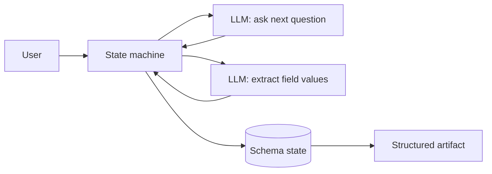
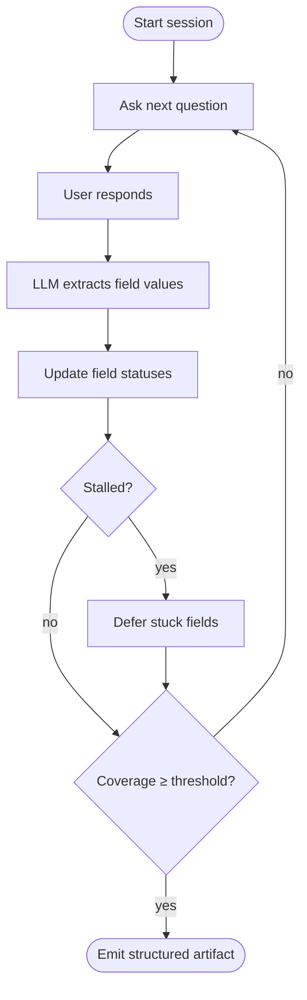
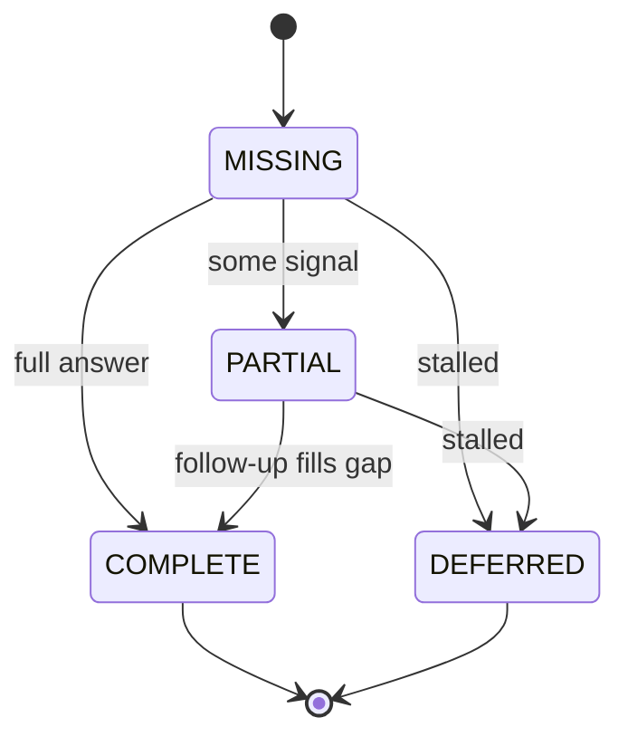

Quick context: I built a system that runs structured interviews. A user has a conversation with an LLM about a topic — an internal intake, a due-diligence questionnaire, a structured assessment — and on the other side comes a structured record. Every required field is filled, partially filled, or explicitly marked as "we couldn't determine this." Conversational on top, schema-driven underneath.

I inherited an agent. Hundreds of lines of prompt, written by hands that had since moved on. Rules referencing bugs I'd never heard of. Three different definitions of "done," each one valid depending on which paragraph you stopped at. I tuned it the way you tune any prompt you didn't write — adding clauses on top, hoping, never sure which one was load-bearing.

Most days, the agent worked. Best on Tuesdays — I never figured out why. Then one Tuesday, the same input produced two different artifacts. Then a third one I'd never seen before.

That was the moment for change. It was time to apply Schumpeter's creative destruction — clear away the old and allow something new to emerge.

What I have now is structurally the opposite. It's a state machine, a schema, and an LLM doing two small jobs. From the user's side, nothing changed. Everything underneath looks different, and I'd ship the new shape on day one of the next project.

> The code in this post is simplified illustration — sketches that show the *shape* of the pattern, not production source.

## Rule 0: the LLM is a function, not the agent

The LLM now does exactly two things. **Generate the next question.** **Extract field values from the response.** That's the whole job. What to ask, when to stop, what to defer, what the artifact looks like — all of that moved into code, where I can put a breakpoint on it.



There's a name for this. It's called "writing software."

The contract is small enough to fit in your head. The entire surface area the system asks of any LLM backend is two methods:

```python
class LLMClient(Protocol):
    async def ask(self, messages) -> str:
        """Return the next question, as text."""

    async def extract(self, messages, *, json_schema) -> dict:
        """Return structured field values, constrained by a JSON schema."""
```

Swapping providers is a new adapter, not a rewrite. The model is a dependency, not the architecture.

## Rule 1: the loop is boring on purpose



Ask, extract, update, decide. That's the entire interview. Here's the turn handler — and notice there's nothing clever in it:

```python
async def handle_user_input(session, user_text):
    record_turn(session, user_text)

    # extract → detect stalls → snapshot coverage
    before = snapshot_field_state(session)
    apply_extraction(session, await extract(session, user_text))
    detect_and_defer_stalls(session, before)
    record_coverage(session)

    return route(session)
```

And the routing — the part that decides whether the interview is over — is just a sequence of boolean checks against the schema:

```python
def route(session):
    if session.schema.is_complete:
        return finish(session)
    if session.schema.is_blocked:          # everything left has been deferred
        return block(session)
    if session.turn_number >= MAX_TURNS:
        return finish(session)
    return ask_next_question(session)
```

Coverage is a float. Completion is a threshold. Stall is a counter. None of it is impressive on a slide. All of it is testable on a Tuesday.

```python
def coverage_score(schema) -> float:
    scorable = [f for f in schema.required_fields if f.status != NOT_APPLICABLE]
    if not scorable:
        return 1.0
    points = sum(
        1.0 if f.status == COMPLETE else 0.5 if f.status == PARTIAL else 0.0
        for f in scorable
    )
    return points / len(scorable)

def is_complete(schema) -> bool:
    return (
        coverage_score(schema) >= schema.threshold
        and not any(f.status == MISSING for f in schema.required_fields)
    )
```

I will fight for boring loops. The one place I want surprise in this system is the language the model produces, not the control flow. Surprising control flow in production is the engineering equivalent of a smoke alarm going off at 3am — and the smoke alarm is right.

## Rule 2: every field has a graceful exit



Every field's life is one enum:

```python
class FieldStatus(StrEnum):
    MISSING        = "missing"
    PARTIAL        = "partial"      # some info, but not enough
    COMPLETE       = "complete"
    DEFERRED       = "deferred"     # gave up on purpose — recorded as "couldn't determine"
    NOT_APPLICABLE = "n/a"
```

Look at `DEFERRED`. That state is the most useful thing on this whole diagram. The previous version would chase a single missing detail forever because no one had told it that giving up was an option. The current version notices when nothing is changing, writes "we couldn't determine X" into the artifact on purpose, and moves on.

"Notices when nothing is changing" isn't a vibe — it's a counter per field group. A group "improved" if any field in it changed status or value this turn; if not, the counter ticks. When it hits the threshold, the stuck fields are deferred and the loop moves on:

```python
def tick(counter, group, improved) -> int:
    counter[group] = 0 if improved else counter.get(group, 0) + 1
    return counter[group]

# when a group makes no progress for N consecutive turns:
if tick(counter, group, improved) >= MAX_STALL_TURNS:
    for field in stuck_fields(group):
        field.status = FieldStatus.DEFERRED
```

`DEFERRED` is also a more honest design than people expect. The reviewer doesn't have to play "did the agent finish or did the user wander off?" — the artifact tells them.

## The features I'm a little smug about

The interesting stuff isn't the model. It's the scaffolding the small model job lets you build.

- **Schema-enforced extraction.** The model doesn't return JSON because I asked nicely — it returns JSON because the API contract makes any other shape impossible. The response schema is built from exactly the fields in play, with `additionalProperties: false` so the provider rejects drift, confidence bounded to `[0, 1]`, and status constrained to the enum:

  ```python
  schema = {
      "type": "object",
      "additionalProperties": False,            # no surprise keys
      "required": ["values", "confidences", "statuses"],
      "properties": {
          "values":      {"type": "object", "additionalProperties": False, "properties": value_props},
          "confidences": {
              "type": "object", "additionalProperties": False,
              "properties": {fid: {"type": "number", "minimum": 0, "maximum": 1} for fid in field_ids},
          },
          "statuses": {
              "type": "object", "additionalProperties": False,
              "properties": {fid: {"type": "string", "enum": [s.value for s in FieldStatus]} for fid in field_ids},
          },
      },
  }
  ```

  Enforced at the provider, not in my prompt.
- **Schema swap on load.** Sessions persist runtime state, not schemas. The schema itself is fetched fresh from a registry on every load, and the stored field values are *overlaid* onto it:

  ```python
  def apply_saved_state(schema, saved):
      """Overlay saved runtime state onto a freshly-loaded schema."""
      for field in schema.fields:
          state = saved.get(field.id)
          if state is None:
              continue                  # untouched field keeps its default (MISSING)
          field.value      = state["value"]
          field.status     = FieldStatus(state["status"])
          field.confidence = state["confidence"]
  ```

  Translation: I can fix a question's wording on Wednesday afternoon, and the interview somebody started Wednesday morning picks it up on the next turn. No migrations. No broken-in-flight nightmares.
- **Trace viewer.** Every prompt and every response is captured to a JSONL file and rendered as an HTML timeline. The day you have a trace viewer is the day you stop arguing about what the model "probably" did. You point at the timeline. The argument ends.
- **Streaming end to end.** Tokens arrive live, then a structured progress event, then the next question, all over Server-Sent Events. The chat feel and the structured contract ride the same transport. The frontend does not have to choose.
- **Synthetic users.** Tests run against simulated personas — cooperative, evasive, confused. Each persona is an LLM prompted with a fixed goal and a behaviour profile, which keeps the simulation deterministic enough to be useful in CI:

  ```python
  EVASIVE = (
      "Deflect specific questions when you can. Use vague language — "
      "'that's still being figured out', 'someone else handles that'. "
      "Don't lie; just give minimal, vague answers."
  )
  ```

  A persona can even *know* a value but refuse to share it until pressed — which is how I test whether the agent persists on required fields without looping forever. These tests catch a class of failure unit tests can't see, because unit tests don't know how to be evasive.
- **Scripted backbone, generated follow-ups.** Author the questions you care about; let the model generate the rest. The engine reaches for a scripted question first and only generates from the schema's gaps when the script runs out:

  ```python
  if session.scripted_questions:
      return present(session.scripted_questions.pop(0))   # author-controlled backbone

  gap = session.schema.largest_gap_group()                # script exhausted
  return generate_question_for(gap)                        # model fills the rest
  ```

  Pure scripted is rigid, pure generated drifts; the mix is where it works.
- **One engine, three surfaces.** The same core runs an interactive CLI, a streaming REST API, and an experiment runner. New surface = thin layer over the same engine. I have shipped systems where this was not true. I do not recommend those systems.

## The parts I'd warn you about

The state machine moves complexity. It does not remove it. The schema now needs versioning, owners, and a review process. Schemas are nicer to read than prompts; they are not free.

Schemas force you to specify the goal upfront. That's a feature when the domain is well-defined. It's a footgun when the right answer is "it depends, and the dependency only became clear at turn six." If your problem is genuinely emergent, this is the wrong shape.

Self-reported LLM confidence is not confidence. The schema *collects* a confidence value per field, bounded to `[0, 1]` — but I treat it as a relative signal between fields in a single call, not as a probability of correctness. I don't gate decisions on it. If you do, you will eventually learn not to, in a way that is worse than reading this paragraph.

One more thing this isn't: a multi-agent system, an autonomous workflow with tool calls, or "an agent" in the sense most LinkedIn posts use that word. The LLM here is the smallest piece — it generates a question, it extracts fields, that's the contract. If your problem needs the model to plan, call APIs, branch on the results, and chain those calls into more calls, you want a different shape entirely. There's nothing wrong with that shape. It's just not this one.

## What's portable

The pattern — declared schema, narrow LLM jobs, state in code — generalizes well past where I started. Anywhere structured data has to come out of a conversation with a person who doesn't think in fields, this shape works. I'm seeing it pulled into use cases I didn't design for, which is the cheapest possible signal that the abstraction is the right one.

The hard part, every time, is the spec. Not the model. Not the prompts. Not the framework. Deciding ahead of time exactly what you want to know — and being honest about what you don't — is where the project lives or dies. The LLM just shows up afterward and does the typing.
